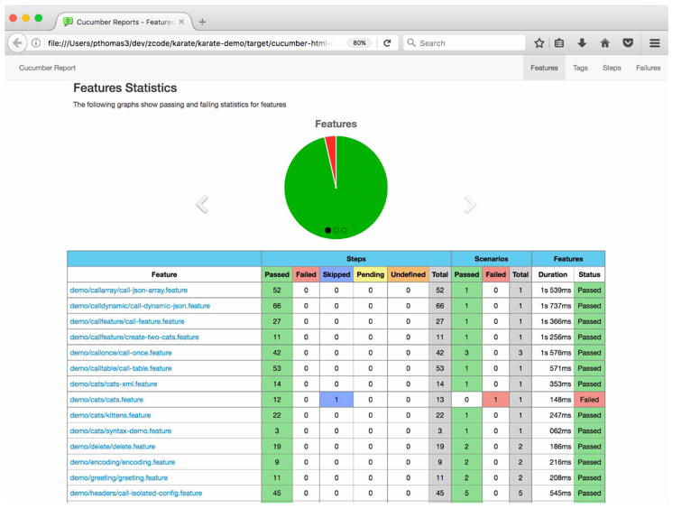

# RetoWebTevolvers

# Prueba técnica
## Automatizacion Apis

### Herramientas de automatización karate framework
<p >
  <a href="https://serenity-bdd.github.io/theserenitybook/latest/index.html"> 
  </a>
   
  </a>
  <a href="https://cucumber.io/">
  
  </a>
  <a href="https://gradle.org/"> 
   
  </a> 
</p>


### Escenarios de prueba

- booking GET
- Create booking POST
- Create Token POST
- Update booking PUT
- 

### Reporte cucumber
Usando la clase CucumberReport podra generar el reporte y la salida del escenario de prueba



Git global setup
```sh
git config --global user.name "Hervin Camargo Carlier"
git config --global user.email "hervincamargo@gmail.com.com"
```

Comando Push en proyecto existente
```sh
git init
git add .
git commit -m "Add existing project files to Git"
git remote add origin https://github.com/automatizaciontesting/RetoApiKarateFramework.git
git push -u -f origin main
```
